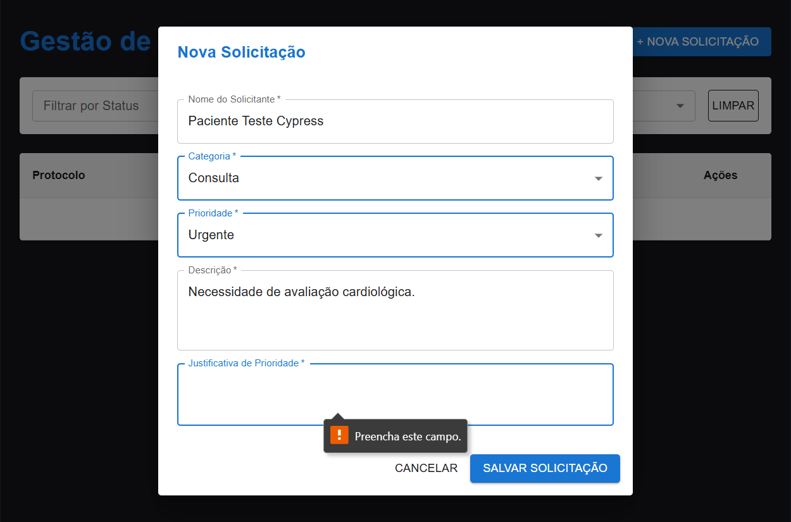

# Desafio Técnico V-Lab: Gestão de Solicitações

Este projeto é uma aplicação Full-Stack desenvolvida para o desafio técnico do V-Lab. Consiste num sistema de gestão de solicitações, permitindo a criação, listagem, filtragem e tramitação de status através de uma máquina de estados com regras de negócio rigorosas.

## 🚀 Tecnologias Utilizadas

* **Backend:** Laravel 11 (API REST)
* **Frontend:** React + TypeScript + Vite + Material-UI (MUI)
* **Banco de Dados:** PostgreSQL
* **Infraestrutura:** Docker e Docker Compose

## ⚙️ Regras de Negócio Implementadas

* **Geração de Protocolo:** Cada solicitação recebe um protocolo único automático de 10 caracteres no momento da criação.
* **Justificativa Dinâmica:** O campo de justificativa é obrigatório apenas quando a prioridade selecionada é "URGENTE".
* **Máquina de Estados de Status:**
  * `RECEBIDA` -> Pode avançar para `EM_ANALISE` ou ser `CANCELADA`.
  * `EM_ANALISE` -> Pode avançar para `AGENDADA` ou ser `CANCELADA`.
  * `AGENDADA` -> Pode avançar para `CONCLUIDA` ou ser `CANCELADA`.
  * `CONCLUIDA` / `CANCELADA` -> Status finais. Não podem ser alterados.

## 📦 Como rodar o projeto localmente

O projeto está totalmente containerizado. Certifique-se de ter o **Docker** e o **Docker Compose** instalados na sua máquina.

**1. Clone o repositório**

```bash
git clone https://github.com/Arthur-Carvalh01/vlab-solicitacoes.git
cd vlab-solicitacoes
```

**2. Suba a infraestrutura com o Docker**

```bash
docker-compose up -d --build
```

**3. Configure o Banco de Dados (Migrations)**

Como o backend roda dentro do container, execute as migrations do Laravel com o comando:
```bash
docker exec -it vlab_api php artisan migrate
```

**4. Acesse a Aplicação**
* **Frontend:** [http://localhost:5173](http://localhost:5173)
* **Backend (API):** [http://localhost:8000/api/v1/solicitacoes](http://localhost:8000/api/v1/solicitacoes)

## 🧪 Testes Automatizados

O projeto conta com testes de integração e ponta a ponta (E2E) para garantir a estabilidade das regras de negócio e da interface.

* **Backend (PHPUnit):** Testes de validação da máquina de estados, garantindo que transições inválidas (ex: `RECEBIDA` diretamente para `CONCLUIDA`) sejam bloqueadas pela API.
* **Frontend (Cypress):** Testes E2E simulando o comportamento do utilizador, com validação de campos obrigatórios dinâmicos (como a exigência de justificativa para prioridade URGENTE) e integração visual com os componentes do Material-UI.



**Para executar os testes:**
* **Backend:** `docker-compose exec api php artisan test`
* **Frontend:** Navegue até à pasta `/frontend` e execute `npx cypress open`

## 📖 Documentação da API

A especificação completa dos endpoints, parâmetros e regras de requisição/resposta da API foi construída seguindo o padrão OpenAPI 3.0. 

Você pode consultar a documentação técnica diretamente no arquivo [openapi.yaml](./openapi.yaml) localizado na raiz deste repositório. Para uma visualização interativa, basta colar o conteúdo do arquivo no [Swagger Editor](https://editor.swagger.io/).